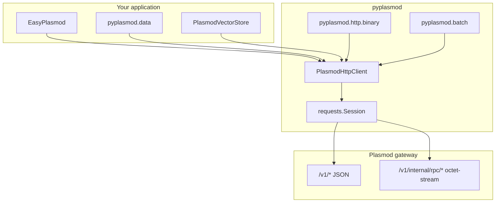

# pyplasmod SDK reference

> **中文** | [zh-CN/SDK.md](zh-CN/SDK.md)

> **Getting started** (install, start the gateway, a 5-minute walkthrough, environment variables, scenario examples): see the repository root **[README.md](../README.md)**.  
> This document covers **SDK architecture, how modules are implemented, and a complete API index**.

---

## 1. Overview and scope

**pyplasmod** is the **Python HTTP client** for [Plasmod](https://github.com/CodeSoul-co/Plasmod). It calls the deployed gateway’s JSON APIs via `requests` and provides binary frame encoding and decoding for selected `/v1/internal/rpc/*` endpoints.

| Included | Not included |
|----------|----------------|
| Tier A JSON (ingest, query, memory, admin, and related routes) | The Plasmod server process itself |
| Tier B extended JSON (internal task/MAS, CRUD, and related routes) | gRPC, collection/schema ORM |
| PLIB / PLQW / PLQB binary RPC wrappers | Auto-generated OpenAPI clients |
| `.fbin` → `ingest_event` batch helpers | Authoritative server routes or field definitions (see Plasmod `docs/api`) |

**Authoritative server contract:** [Plasmod HTTP API](https://github.com/CodeSoul-co/Plasmod/tree/main/docs/api). Binary frame layout aligns with Go `src/internal/transport/framing.go` on the Plasmod side.

---

## 2. Architecture



**Typical RAG data flow**

1. **Ingest:** `.fbin` files via `upload()` build one `ingest_event` per row → `POST /v1/ingest/events`; or use `ingest_document`, `ingest_vectors`, or `rpc_ingest_batch`.
2. **Materialization:** The gateway materializes events into Memory (not implemented in the client).
3. **Query:** `build_query_body` assembles JSON → `POST /v1/query` → returns `objects`, `hits`, and related fields (shape varies by server version).
4. **Operations:** `p.http.dataset_delete`, `dataset_purge`, and similar routes under `/v1/admin/*` require `X-Admin-Key` when the gateway enforces admin auth.

---

## 3. Modules and responsibilities

| Module | File | Responsibility |
|--------|------|----------------|
| Package entry | `pyplasmod/__init__.py` | Exports `EasyPlasmod`, `PlasmodEmbedding`, `PlasmodClient`, `plasmod_help`, codec functions, and more; lazy-loads `PlasmodVectorStore` |
| Facade | `pyplasmod/easy.py` | `EasyPlasmod`: common JSON calls, `.embedding` / `embed_*` for gateway embedding, `.http` for the full client |
| Gateway embedding | `pyplasmod/embedding/` | `PlasmodEmbedding` (recommended), `EmbedderConfig` CPU/GPU presets, `GatewayEmbedding`; see [EMBEDDING.md](EMBEDDING.md) |
| HTTP client | `pyplasmod/http/client.py` | `PlasmodHttpClient`: `request_json` / `request_bytes`, Tier A/B methods, `rpc_*`, batch `ingest_batch` |
| Warm index helpers | `pyplasmod/http/warm_index.py` | ANN `index_type` constants, `normalize_warm_index_type`, `warm_index_ingest_fields` for `POST /v1/ingest/vectors` |
| Binary frames | `pyplasmod/http/binary.py` | `encode_ingest_batch` (PLIB), `encode_query_warm` (PLQW), `encode_query_warm_batch` (PLQB), and decoders |
| HTTP errors | `pyplasmod/http/errors.py` | `PlasmodHttpError` |
| General exceptions | `pyplasmod/exceptions.py` | `PlasmodException`, `ConnectError`, `ParamError`, and related types |
| Data helpers | `pyplasmod/data/__init__.py` | `upload`, `build_query_body`; CLI: `python -m pyplasmod.data` |
| Batch utilities | `pyplasmod/batch.py` | `iter_batches`, `BatchResult`, `DEFAULT_BATCH_SIZE` |
| In-package help | `pyplasmod/package_help.py` | `plasmod_help`, `plasmod_topics` |
| LangChain | `pyplasmod/langchain/vectorstore.py` | `PlasmodVectorStore` (optional dependency) |

Design background: [plans/pyplasmod-001-http-sdk-design.md](plans/pyplasmod-001-http-sdk-design.md).

---

## 4. Choosing a client entry point

| Symbol | Type | When to use |
|--------|------|-------------|
| `EasyPlasmod` | Facade class | Default for application integration: `health`, `search`, `query`, `upload_fbin`, `ingest_document`, `memories` |
| `PlasmodEmbedding` | Nested facade | Gateway-side text embedding, CPU/GPU deployment presets, `runtime()` probe; `with PlasmodEmbedding.connect()` |
| `PlasmodClient` / `PlasmodHttpClient` | Same full client | Admin, RPC, CRUD, internal routes, WAL SSE, bulk vectors |
| `upload` / `build_query_body` | Module-level functions | Scripts or pipelines: `client=None` for a temporary connection, or `client=p.http` to reuse a session |
| `PlasmodVectorStore` | LangChain adapter | Client-side embed + `rpc_ingest_batch`; different from gateway embedding |

`EasyPlasmod` does **not** duplicate the full API. It delegates through **`self.http: PlasmodHttpClient`**:

```python
class EasyPlasmod:
  def __init__(...):
    self.http = PlasmodHttpClient(base_url=..., timeout=..., admin_key=..., session=...)
  def search(self, query_text, workspace_id, **kwargs):
    return self.http.query(build_query_body(query_text, workspace_id, **kwargs))
```

Context manager support: `with EasyPlasmod() as p:` calls `close()` on the underlying `requests.Session`.

---

## 5. Configuration and environment variables

`PlasmodHttpClient.__init__` resolves settings in this order (constructor arguments override environment variables):

| Setting | Environment variable | Default |
|---------|----------------------|---------|
| Gateway base URL | `PLASMOD_BASE_URL` / `ANDB_BASE_URL` | `http://127.0.0.1:8080` |
| HTTP timeout (seconds) | `PLASMOD_HTTP_TIMEOUT` / `ANDB_HTTP_TIMEOUT` | `30` |
| Admin key | `PLASMOD_ADMIN_API_KEY` / `ANDB_ADMIN_API_KEY` | empty (header not sent) |

**Admin routes:** For any path where `path.startswith("/v1/admin/")` and `admin_key` is non-empty, the client sets `X-Admin-Key` automatically. Whether the gateway requires it depends on deployment (`PLASMOD_ADMIN_API_KEY` on the server).

Pass an existing `requests.Session` to share a connection pool with your application.

---

## 6. HTTP transport layer

### 6.1 `request_json`

1. Merge admin headers with `Accept: application/json`.
2. `session.request(method, base_url + path, json=..., params=..., timeout=...)`.
3. Network failures → `PlasmodHttpError(status_code=0, reason=..., path=...)`.
4. Non-2xx → `PlasmodHttpError` (includes `status_code`, `body` text, `response_headers`).
5. 2xx with empty body → `None`; if `Content-Type` includes `json` or `resp.json()` succeeds → parsed `dict` / `list`.

### 6.2 `request_bytes`

Used for binary RPC: `POST` with `data=payload` and `Content-Type: application/octet-stream`. Returns `(status_code, raw_bytes, headers)`; `rpc_*` methods check `status == 200` and decode.

### 6.3 WAL SSE: `iter_wal_stream_events`

- `GET /v1/wal/stream` with `stream=True` and timeout `(connect_timeout, None)` so long-lived connections are not cut off by read timeout.
- Parses `event: wal` lines with JSON in `data:`; skips comment heartbeat lines starting with `:`.
- On iteration end or exception, `resp.close()` runs in `finally`.

---

## 7. `pyplasmod.data` implementation

### 7.1 `.fbin` file format

| Offset | Content |
|--------|---------|
| 0–3 | `uint32` row count `n` (little-endian) |
| 4–7 | `uint32` dimension `dim` |
| 8+ | `n × dim` `float32` values (little-endian), row-major |

`upload()` accepts **only** the `.fbin` suffix (case-insensitive); otherwise it raises `ValueError`.

### 7.2 `upload()` flow

```
Read header → iterate rows
  → _build_fbin_event(...) builds ingest event dict
  → client.ingest_event(body)   # POST /v1/ingest/events, once per row
```

**Event field highlights** (aligned with gateway `MaterializeEvent`):

- Top-level `embedding_vector`: full float vector.
- `workspace_id`, `agent_id` (default `pyplasmod_data`), `session_id` (default `ingest_{dataset}_{filename}`).
- `payload`: `text` (includes `dataset=`, `dataset_name:`, and similar markers), `dataset`, `file_name`, `row_index`, `import_batch_id`, and related fields.
- `event_id`: derived from dataset, filename, `import_batch_id`, and `seq` for batch distinguishability.

**Parameter behavior:**

- `limit > 0`: ingest at most the first `limit` rows.
- Empty `import_batch_id`: each `upload()` call generates a new UTC timestamp batch id (unique even for two calls in the same second).
- `dry_run=True`: build only the first row’s event; no POST.
- `show_progress=True`: single-line progress bar on stderr.

### 7.3 `build_query_body()` and session alignment

Does **not** perform HTTP; returns the `dict` for `POST /v1/query`.

Default `session_id` rules:

- Non-empty `session_id` argument → use it.
- Else if both `dataset_name` and `ingest_fbin_path` are set → `ingest_{dataset}_{Path(ingest_fbin_path).name}` (same default as `upload`).
- Else → `query_{workspace_id}`.

Both `query_scope` and `workspace_id` are set to the supplied `workspace_id`. `extra={...}` is merged last and can override any field.

Optional `embedding_vector`: when provided, the gateway **does not** call the embedder (dimension must match `PLASMOD_EMBEDDER_DIM`).

**Important:** When the gateway filters on structured fields such as `dataset_name`, query `session_id` / `agent_id` must match ingest values or recently imported data may not appear in results.

---

## 8. Gateway embedding (`pyplasmod.embedding`)

User guide: [EMBEDDING.md](EMBEDDING.md). Plasmod has **no** `POST /v1/embed`; embedding runs inside ingest and query paths.

### 8.1 Recommended: `PlasmodEmbedding`

```python
from pyplasmod import PlasmodEmbedding

with PlasmodEmbedding.connect() as emb:
    emb.ingest("text", workspace_id="w_demo")
    emb.search("query", workspace_id="w_demo", top_k=5)
    emb.runtime()  # EmbeddingRuntimeInfo: family, dim
```

`EasyPlasmod.embedding` is the same facade (lazy-loaded); `embed_ingest` / `embed_search` are shorthand.

### 8.2 CPU / GPU deployment presets

| Method | Device |
|--------|--------|
| `use_cpu("onnx", model_path=..., apply=True)` | CPU |
| `use_gpu("onnx", model_path=..., apply=True)` | CUDA |
| `use_onnx_cpu` / `use_onnx_gpu` | Explicit ONNX |
| `use_gguf_cpu` / `use_gguf_gpu` | GGUF + llama.cpp |
| `use_gpu("tensorrt", ...)` | TensorRT (CUDA only) |

`apply=True` → `EmbedderConfig.apply_to_environ()`; run **before starting the Plasmod process**.

`capabilities()` / `format_capability_table()` print the provider × {cpu, cuda, metal} matrix.

### 8.3 Runtime probe

`POST /v1/query` response `provenance` may include:

- `embedding_runtime_family=...`
- `embedding_runtime_dim=N`

`PlasmodHttpClient.fetch_embedding_runtime()` and `PlasmodEmbedding.runtime()` parse these fields. They do **not** include `device` (device comes from server `PLASMOD_EMBEDDER_DEVICE` only).

### 8.4 Module layers

| Layer | Type | Role |
|-------|------|------|
| User | `PlasmodEmbedding` | `ingest` / `search` / `use_*` / `runtime` |
| Config | `EmbedderConfig` | Environment variables ↔ presets |
| HTTP | `GatewayEmbedding` | Thin wrapper over `PlasmodHttpClient` |

---

## 9. Binary RPC (PLIB / PLQW / PLQB)

Implemented in `pyplasmod/http/binary.py`, aligned with Go `framing.go`.

| Magic | Purpose | Client method |
|-------|---------|---------------|
| `PLIB` | Batch vector ingest | `rpc_ingest_batch` → `POST /v1/internal/rpc/ingest_batch` |
| `PLQW` | Single-vector warm query | `rpc_query_warm` |
| `PLQB` | Multi-vector warm batch query | `rpc_query_warm_batch`, `rpc_query_warm_batch_raw` |

`PlasmodHttpClient.ingest_batch()` shards by `DEFAULT_BATCH_SIZE` (500) on top of RPC and aggregates into `BatchResult` (`accepted_count`, `errors`, and related fields).

You may also use root-package `encode_*` / `decode_*` with `request_bytes` directly.

---

## 10. Batching and JSON vector ingest

| Method | Path | Notes |
|--------|------|-------|
| `ingest_vectors(vectors, segment_id=..., object_ids=..., index_type=..., ivf_*=...)` | `POST /v1/ingest/vectors` | JSON matrix; **warm ANN index type** (HNSW, IVF_*, DISKANN) — see below |
| `ingest_batch(segment_id, vectors, ...)` | RPC PLIB | Large batches with automatic chunking; **no `index_type`** (gateway default) |
| `ingest_events(events)` | Multiple `ingest_event` | One event per call |
| `add_vectors(...)` | Wraps `ingest_batch` + optional `ingest_event` | PLIB path; same index-type limitation as `ingest_batch` |

Vector dimension must match the gateway warm segment / embedder configuration.

### Warm segment ANN index (`ingest_vectors` only)

`PlasmodHttpClient.ingest_vectors` builds a warm segment from caller-supplied vectors. The ANN index is chosen at **ingest time** via JSON fields aligned with Plasmod `warm_segment_ingest` (see gateway `schemas/warm_segment_ingest.go`).

| `index_type` | Typical use |
|--------------|-------------|
| `HNSW` (default when omitted) | General-purpose, low-latency search |
| `IVF_FLAT` / `IVF_PQ` / `IVF_SQ8` | Larger corpora; tune `ivf_nlist`, `ivf_nprobe`, and related fields |
| `DISKANN` | Disk-friendly, very large scale |

Optional IVF fields (sent only when non-zero / non-empty): `ivf_nlist`, `ivf_nprobe`, `ivf_m`, `ivf_nbits`, `ivf_sq_type` (`INT8` / `FP32` for `IVF_SQ8`). Use root-package constants (`WARM_INDEX_IVF_FLAT`, etc.) or `normalize_warm_index_type("ivf_flat")`.

```python
from pyplasmod import PlasmodClient, WARM_INDEX_IVF_FLAT

with PlasmodClient() as c:
    c.ingest_vectors(
        [[0.1, 0.2, ...]],
        segment_id="demo.ivf",
        index_type=WARM_INDEX_IVF_FLAT,
        ivf_nlist=128,
        ivf_nprobe=32,
    )
```

**Path split:** `ingest_batch` / `rpc_ingest_batch` (PLIB) do not expose `index_type` in the SDK today. For non-default ANN indexes, use `ingest_vectors` (possibly in multiple calls per segment) until PLIB supports index metadata.

Query the same `segment_id` / `warm_segment_id` that was built with that index.

`validate_batch_size` constrains `batch_size` to `[1, MAX_BATCH_VECTORS]` (`MAX_BATCH_VECTORS = 2^22`).

---

## 11. Error model

| Type | When raised |
|------|-------------|
| `PlasmodHttpError` | HTTP non-2xx, RPC non-200, or `requests` failure before a response (`status_code=0`) |
| `PlasmodException` | A batch in bulk ingest fails with `raise_on_error=True` |
| `ValueError` | Invalid arguments, unsupported `.fbin` suffix, corrupt `upload` file, and similar |
| `FileNotFoundError` | `upload` path does not exist |

Example:

```python
from pyplasmod import EasyPlasmod, PlasmodHttpError

try:
    with EasyPlasmod() as p:
        p.query({"invalid": True})
except PlasmodHttpError as e:
    print(e.status_code, e.path, e.body[:200])
```

More patterns: [plans/pyplasmod-003-sdk-usage-guide.md](plans/pyplasmod-003-sdk-usage-guide.md).

---

## 12. LangChain integration

`PlasmodVectorStore` (`pyplasmod/langchain/vectorstore.py`):

- Holds `PlasmodHttpClient` and a LangChain `Embeddings` instance at construction.
- `add_texts` / `add_documents`: local embed → `rpc_ingest_batch` (chunked) plus best-effort `ingest_event` for metadata. Does **not** select warm ANN `index_type`; use `ingest_vectors` if you need IVF/DISKANN on a segment.
- `similarity_search*`: `build_query_body` + `query`, or warm path `rpc_query_warm`.
- `delete`, `max_marginal_relevance_search`: not implemented (`NotImplementedError`).

Install: `pip install pyplasmod[langchain]`. Example: `examples/langchain_quickstart.py`.

---

## 13. In-package help (`plasmod_help`)

`plasmod_help(topic=None)` (`pyplasmod/package_help.py`):

| Topic key | Content |
|-----------|---------|
| `easy` | `EasyPlasmod` overview + full `pydoc` text |
| `client` | `PlasmodHttpClient` index (prefer `help(PlasmodHttpClient)`) |
| `upload` | `pyplasmod.data.upload` |
| `querybody` | `build_query_body` |
| `errors` | `PlasmodHttpError` |
| `binary` | `pyplasmod.http.binary` module |
| `env` | Environment variable reference |
| `embedding` | `PlasmodEmbedding` / CPU·GPU presets |

Aliases: `plasmodclient`→`client`, `fbin`/`ingest`→`upload`, and others. CLI: `python -m pyplasmod [topic]` (`pyplasmod/__main__.py`).

---

## 14. API index (by module)

Functions and methods with **name + purpose**. Private helpers (`_url`, `_finish_json`, and similar) are omitted. Paths and request bodies follow the Plasmod gateway.

### 14.1 Root package `from pyplasmod import …`

| Symbol | Purpose |
|--------|---------|
| **`EasyPlasmod`** | Facade entry class (see §14.2) |
| **`PlasmodEmbedding`** | Gateway embedding facade (see §8, `embedding/facade.py`) |
| **`open_embedding`** | Alias for `PlasmodEmbedding.connect` |
| **`EmbedderConfig`**, **`EmbeddingRuntimeInfo`** | CPU/GPU config and runtime probe |
| **`PlasmodClient`** | Alias for `PlasmodHttpClient` |
| **`PlasmodHttpError`** | Raised on non-2xx HTTP |
| **`PlasmodException`**, `ConnectError`, `ParamError`, `PlasmodUnavailableException` | SDK exception taxonomy |
| **`BatchResult`** | Aggregated batch operation result |
| **`DEFAULT_BATCH_SIZE`**, **`MAX_BATCH_VECTORS`** | Default chunk size and upper bound |
| **`iter_batches`**, **`validate_batch_size`** | Batch iteration and validation |
| **`encode_ingest_batch`**, and related | Binary frame codecs (no HTTP) |
| **`WARM_INDEX_HNSW`**, **`WARM_INDEX_IVF_*`**, **`WARM_INDEX_DISKANN`**, **`WARM_INDEX_TYPES`** | Supported warm ANN index type strings |
| **`normalize_warm_index_type`**, **`warm_index_ingest_fields`** | Validate / build JSON fields for `ingest_vectors` |
| **`plasmod_help`**, **`plasmod_topics`** | Topic-based help |
| **`__version__`** | Package version |
| **`PlasmodVectorStore`** | LangChain adapter (lazy-loaded) |

### 14.2 `EasyPlasmod` instance methods

| Method | HTTP | Purpose |
|--------|------|---------|
| **`__init__(base_url=..., timeout=..., admin_key=..., session=...)`** | — | Construct; reads environment variables |
| **`close()`** | — | Close Session |
| **`health()`** | `GET /healthz` | Liveness probe |
| **`system_mode()`** | `GET /v1/system/mode` | System mode |
| **`query(body)`** | `POST /v1/query` | Full query JSON |
| **`search(query_text, workspace_id, **kwargs)`** | `POST /v1/query` | `build_query_body` + `query` |
| **`ingest_event(event)`** | `POST /v1/ingest/events` | Single event |
| **`ingest_document(body)`** | `POST /v1/ingest/document` | Long-document chunking |
| **`upload_fbin(...)`** | `POST /v1/ingest/events` (per row) | Wraps `data.upload` |
| **`memories(workspace_id, **params)`** | `GET /v1/memory` | List Memory |
| **`embedding`** | — | **`PlasmodEmbedding`** (lazy) |
| **`embed_ingest` / `embed_search`** | ingest / query | Shorthand for `embedding.ingest` / `search` |
| **`embedding_runtime(**kw)`** | query probe | `embedding.runtime` |
| **`http`** | — | Full **`PlasmodHttpClient`** |

### 14.3 `pyplasmod.embedding`

| Symbol | Purpose |
|--------|---------|
| **`PlasmodEmbedding`** | Recommended facade: `connect`, `ingest`, `search`, `use_cpu`/`use_gpu`, `runtime` |
| **`open_embedding()`** | Factory |
| **`EmbedderConfig`** | `onnx_cpu`/`onnx_cuda`/… presets, `to_environ` / `from_environ` |
| **`GatewayEmbedding`** | Low-level HTTP wrapper |
| **`format_capability_table()`** | CPU/GPU capability table |

### 14.4 `pyplasmod.data`

| Function | Purpose |
|----------|---------|
| **`build_query_body(query_text, workspace_id, *, ...)`** | Build query `dict` only |
| **`upload(dataset, workspace_id, path, *, client=..., ...)`** | `.fbin` → multiple `ingest_event` |

CLI: `python -m pyplasmod.data upload|query ...`

### 14.5 `PlasmodHttpClient` — general HTTP

| Method | HTTP | Purpose |
|--------|------|---------|
| **`request_json(...)`** | any | JSON request |
| **`request_bytes(...)`** | any | Raw body |
| **`health()`** | `GET /healthz` | |
| **`system_mode()`** | `GET /v1/system/mode` | |
| **`ingest_event(event)`** | `POST /v1/ingest/events` | |
| **`ingest_vectors(...)`** | `POST /v1/ingest/vectors` | JSON vectors; optional `index_type`, IVF tuning (`ivf_nlist`, …) |
| **`ingest_document(body)`** | `POST /v1/ingest/document` | |
| **`query(body)`** | `POST /v1/query` | |
| **`query_batch(body)`** | `POST /v1/query/batch` | Warm batch ANN |
| **`memory_get(params)`** | `GET /v1/memory` | |
| **`memory_post(body)`** | `POST /v1/memory` | |
| **`ingest_batch(...)`** | RPC | Auto-chunked PLIB |
| **`add_vectors(...)`** | RPC + optional event | High-level bulk add |
| **`ingest_events(...)`** | multiple events | Event list |
| **`batch_query(...)`** | `query_batch` | Large query wrapper |
| **`iter_wal_stream_events(...)`** | `GET /v1/wal/stream` | SSE WAL |
| **`rpc_ingest_batch`** | `POST .../ingest_batch` | PLIB |
| **`rpc_query_warm`** | `POST .../query_warm` | PLQW |
| **`rpc_query_warm_batch`** / **`rpc_query_warm_batch_raw`** | `POST .../query_warm_batch*` | PLQB |

### 14.6 Admin, datasets, and memory operations

| Method | Purpose |
|--------|---------|
| **`admin_memory_delete_by_source(body)`** | Soft-delete memory by source |
| **`admin_memory_purge_by_source(body)`** | Hard delete / async purge by source |
| **`warm_prebuild()`** | Warm prebuild |
| **`dataset_delete(body)`** | Soft-delete dataset |
| **`dataset_purge(body)`** | Dataset purge |
| **`dataset_purge_task(task_id)`** | Purge task status |
| **`admin_dataset_purge`** / **`admin_dataset_purge_task`** | Aliases |
| **`warm_segment_register(body)`** | Register warm segment |
| **`admin_topology_get`**, **`admin_storage_get`**, **`admin_config_effective_get`** | Topology / storage / config |
| **`admin_s3_export`**, and related | S3 operations |
| **`admin_data_wipe`**, **`admin_rollback`**, **`admin_replay`** | High-risk operations |
| **`admin_consistency_mode_*`**, **`admin_metrics_get`** | Consistency / metrics |
| **`admin_governance_mode_*`**, **`admin_runtime_mode_*`** | Governance / runtime |
| **`admin_algorithm_profile_*`** | Algorithm profiles |

### 14.7 Resource CRUD (JSON)

| Method | Purpose |
|--------|---------|
| **`agents_get/post`**, **`sessions_get/post`** | Agent / Session |
| **`states_get/post`**, **`artifacts_get/post`** | State / Artifact |
| **`edges_get/post`**, **`policies_get/post`** | Edge / Policy |
| **`share_contracts_get/post`** | Share contracts |
| **`traces_get(object_id)`** | Trace / proof chain |
| **`agent_list_get`** | Agent list |

### 14.8 Internal memory, task, and MAS

| Method | Purpose |
|--------|---------|
| **`internal_memory_recall/ingest/compress/summarize/decay/share`** | Internal memory lifecycle |
| **`internal_memory_conflict_*`** | Conflict handling |
| **`internal_task_*`** | Internal tasks |
| **`internal_plan_step/repair`** | Planning |
| **`internal_mas_*`** | MAS aggregation |
| **`internal_tool_state_get`**, **`internal_agent_handoff`** | Tool state / handoff |
| **`internal_session_context_get`** | Session context |
| **`internal_eval_ground_truth_*`** | Evaluation |
| **`debug_echo(body)`** | Debug in test mode |

### 14.9 `pyplasmod.langchain`

| Class / method | Purpose |
|----------------|---------|
| **`PlasmodVectorStore`** | LangChain `VectorStore` implementation |
| **`delete`**, **`max_marginal_relevance_search`** | Not implemented |

### 14.10 Command-line entry points

| Entry | Purpose |
|-------|---------|
| **`python -m pyplasmod [topic]`** | Package help |
| **`python -m pyplasmod.data ...`** | `upload` / `query` subcommands |

---

## 15. Related documentation

| Document | Description |
|----------|-------------|
| [README.md](../README.md) | Install, quick start, scenario examples |
| [EMBEDDING.md](EMBEDDING.md) | Gateway embedding and CPU/GPU (`PlasmodEmbedding`) |
| [plans/pyplasmod-001-http-sdk-design.md](plans/pyplasmod-001-http-sdk-design.md) | HTTP SDK architecture |
| [plans/pyplasmod-002-gateway-tier-b-shortcuts-design.md](plans/pyplasmod-002-gateway-tier-b-shortcuts-design.md) | Tier B extended API |
| [plans/pyplasmod-003-sdk-usage-guide.md](plans/pyplasmod-003-sdk-usage-guide.md) | Usage guide (parameters, examples, troubleshooting) |
| [plans/README.md](plans/README.md) | Design document index |
| [Plasmod docs/api](https://github.com/CodeSoul-co/Plasmod/tree/main/docs/api) | Authoritative server API reference |
