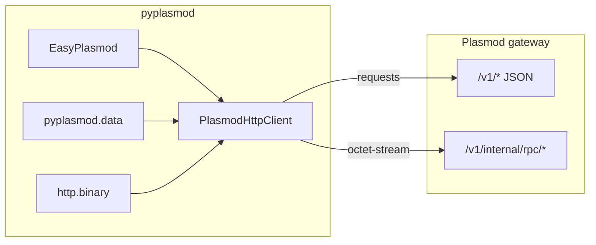

# pyplasmod HTTP SDK architecture

| Metadata | Value |
|----------|-------|
| **Document ID** | pyplasmod-001 |
| **Status** | Implemented (evolves with releases) |
| **Created** | 2026-05-06 |
| **Updated** | 2026-05-18 |
| **Maintainer** | [CodeSoul-co](https://github.com/CodeSoul-co) |
| **Audience** | Application developers integrating pyplasmod; contributors |

> **Quick start:** repository [README.md](../../README.md) (install, start the gateway, examples).  
> **API index and implementation details:** [docs/SDK.md](../SDK.md).  
> **Parameter guidance and scenario examples:** [pyplasmod-003-sdk-usage-guide.md](pyplasmod-003-sdk-usage-guide.md).

---

## 1. Overview

**pyplasmod** is the **Python HTTP client library** for [Plasmod](https://github.com/CodeSoul-co/Plasmod). It talks to a deployed Plasmod gateway over standard HTTP and provides binary frame (PLIB / PLQW / PLQB) encode/decode for selected `/v1/internal/rpc/*` endpoints.

This document describes the client’s **architectural boundaries, module layout, configuration contract, and error model**. Authoritative route and JSON field definitions are in Plasmod’s official documentation:

- [Plasmod HTTP API](https://github.com/CodeSoul-co/Plasmod/tree/main/docs/api)
- Server route registration: [`Gateway.RegisterRoutes`](https://github.com/CodeSoul-co/Plasmod/blob/main/src/internal/access/gateway.go)
- Binary frame layout: server `src/internal/transport/framing.go`

---

## 2. Goals and non-goals

### 2.1 Goals

| Goal | Description |
|------|-------------|
| **Unified HTTP client** | `PlasmodHttpClient` (alias `PlasmodClient`) covering Tier A JSON, binary RPC, and Tier B extended JSON |
| **Simpler application entry** | `EasyPlasmod` facade for health checks, retrieval, document ingest, `.fbin` upload, and other high-frequency paths |
| **Data helpers** | `pyplasmod.data` provides `build_query_body`, `upload` — decoupled from HTTP, reusable connections |
| **Binary interoperability** | `pyplasmod.http.binary` aligned with Go framing for `rpc_*` and advanced integration |
| **Minimal runtime dependencies** | Core depends only on `requests`; LangChain adapter is an optional extra |

### 2.2 Non-goals

- Does not ship Plasmod **server** binaries or deployment logic (see README “Start the Plasmod gateway”).
- No gRPC, collection/schema ORM, or collection/schema management APIs.
- No embedded full OpenAPI copy; field changes follow Plasmod `docs/api`.
- No forward-compatibility guarantee for unpublished or experimental gateway routes (follow what the running gateway registers).

---

## 3. Relationship to the Plasmod gateway

| Layer | Client responsibility | Gateway responsibility |
|-------|----------------------|------------------------|
| Ingest | Build `ingest_event` / `ingest_document` / vector or PLIB frames and POST | Validate, write WAL, materialize Memory, etc. |
| Query | Build `POST /v1/query` JSON | Retrieve, fuse, assemble structured evidence |
| Operations | Call `/v1/admin/*` (with `X-Admin-Key`) | Dataset delete/purge, topology, configuration, etc. |

The client does **not** implement materialization, index construction, or retrieval algorithms — only transport and frame formats.

---

## 4. Module structure

| Module | Path | Responsibility |
|--------|------|----------------|
| Package entry | `pyplasmod/__init__.py` | Public API exports, `__version__`, lazy `PlasmodVectorStore` |
| Application facade | `pyplasmod/easy.py` | `EasyPlasmod`: high-frequency JSON wrappers; `http` exposes full client |
| HTTP client | `pyplasmod/http/client.py` | `PlasmodHttpClient`: `request_json` / `request_bytes`, Tier A/B methods, `rpc_*`, batch helpers |
| Binary frames | `pyplasmod/http/binary.py` | PLIB / PLQW / PLQB encode/decode |
| HTTP errors | `pyplasmod/http/errors.py` | `PlasmodHttpError` |
| General exceptions | `pyplasmod/exceptions.py` | `PlasmodException` and categorized subclasses |
| Data helpers | `pyplasmod/data/__init__.py` | `upload`, `build_query_body`; CLI `python -m pyplasmod.data` |
| Batch utilities | `pyplasmod/batch.py` | `iter_batches`, `BatchResult`, `ingest_batch` chunking |
| In-package help | `pyplasmod/package_help.py` | `plasmod_help`, `plasmod_topics` |
| LangChain (optional) | `pyplasmod/langchain/` | `PlasmodVectorStore` |

---

## 5. API tiers (Tier A / Tier B / RPC)

### 5.1 Tier A (core JSON)

For most integration scenarios, including but not limited to:

| Category | Representative paths | Client entry points |
|----------|---------------------|---------------------|
| Health | `GET /healthz`, `GET /v1/system/mode` | `health()`, `system_mode()` |
| Ingest | `POST /v1/ingest/events`, `/ingest/document`, `/ingest/vectors` | `ingest_event`, `ingest_document`, `ingest_vectors`; `data.upload` |
| Query | `POST /v1/query`, `/query/batch` | `query`, `query_batch`; `EasyPlasmod.search` |
| Memory | `GET/POST /v1/memory` | `memory_get`, `memory_post`; `EasyPlasmod.memories` |
| Admin (subset) | `dataset/delete`, `dataset/purge`, `warm/prebuild`, etc. | `dataset_*`, `warm_prebuild` |
| Internal (subset) | warm-segment registration, memory algorithm bridge | `warm_segment_register`, `internal_memory_*` |

### 5.2 Binary RPC

| Magic | Path | Methods |
|-------|------|---------|
| PLIB | `POST /v1/internal/rpc/ingest_batch` | `rpc_ingest_batch`; high-level `ingest_batch` |
| PLQW | `POST .../query_warm` | `rpc_query_warm` |
| PLQB | `POST .../query_warm_batch` (and `_raw`) | `rpc_query_warm_batch`, `rpc_query_warm_batch_raw` |

### 5.3 Tier B (extended JSON)

Beyond Tier A, `PlasmodHttpClient` provides named thin wrappers for remaining JSON routes in `Gateway.RegisterRoutes` (extended Admin, internal task/MAS, agent list, session context, eval, etc.). See [pyplasmod-002-gateway-tier-b-shortcuts-design.md](pyplasmod-002-gateway-tier-b-shortcuts-design.md).

---

## 6. Configuration contract

When constructing `PlasmodHttpClient` / `EasyPlasmod`, **constructor arguments override environment variables**.

| Setting | Environment variable | Default |
|---------|---------------------|---------|
| Gateway base URL | `PLASMOD_BASE_URL` / `ANDB_BASE_URL` | `http://127.0.0.1:8080` |
| HTTP timeout (seconds) | `PLASMOD_HTTP_TIMEOUT` / `ANDB_HTTP_TIMEOUT` | `30` |
| Admin API key | `PLASMOD_ADMIN_API_KEY` / `ANDB_ADMIN_API_KEY` | empty (no header on Admin routes) |

**Admin authentication:** when `path` starts with `/v1/admin/` and `admin_key` is non-empty, the client sets `X-Admin-Key`. Whether the gateway enforces it depends on deployment configuration (see Plasmod operations docs).

You may pass a `requests.Session` to reuse TCP connections; use `with client:` or `EasyPlasmod.close()` to close a client-owned session.

---

## 7. Error model

| Type | When raised |
|------|-------------|
| `PlasmodHttpError` | HTTP non-2xx; RPC non-200; `requests` failure before a response (`status_code=0`) |
| `PlasmodException` | SDK logic errors such as batch ingest failure with `raise_on_error=True` |
| `ValueError` | Invalid parameters, non-`.fbin` suffix, corrupt `upload` file, etc. |

`PlasmodHttpError` exposes `status_code`, `path`, `body`, `reason` for logging and troubleshooting. Usage: [pyplasmod-003-sdk-usage-guide.md §8](pyplasmod-003-sdk-usage-guide.md#8-error-handling-and-troubleshooting).

---

## 8. Application-layer helpers (aligned with README)

| Scenario | Recommended API | HTTP |
|----------|-----------------|------|
| Long text / documents | `EasyPlasmod.ingest_document` | `POST /v1/ingest/document` |
| Single structured event | `ingest_event` | `POST /v1/ingest/events` |
| Bulk vector file | `pyplasmod.data.upload` / `upload_fbin` | one `ingest/events` per row |
| JSON vector matrix | `ingest_vectors` (optional `index_type`, IVF fields) / `ingest_batch` | `ingest/vectors` or RPC PLIB; ANN index selection on JSON path only |
| Natural-language retrieval | `search` or `build_query_body` + `query` | `POST /v1/query` |

**Session alignment:** `upload` defaults `session_id` to `ingest_{dataset}_{filename}`; `build_query_body` can align automatically when both `dataset_name` and `ingest_fbin_path` are provided. For document ingest, pass the same `session_id` and `agent_id` explicitly at query time.

---

## 9. Design decisions and alternatives

| Decision | Rationale |
|----------|-----------|
| Hand-written thin wrappers vs OpenAPI codegen | Contract still evolving; hand-written methods are IDE-friendly with controlled change surface |
| HTTP-only, no gRPC | Matches Plasmod’s unified deployment story |
| `EasyPlasmod` + `PlasmodHttpClient` dual entry | Lower onboarding cost without limiting advanced integration |
| Tier B in a separate design doc | Large surface area; naming rules need dedicated explanation |

**Not adopted:** single generic `admin_request(subpath)` (poor discoverability); maintaining a full OpenAPI client in sync (high maintenance cost).

---

## 10. Implementation status (summary)

| Capability | Status |
|------------|--------|
| Tier A ingest/query/admin/memory | Implemented |
| Warm ANN `index_type` on `ingest_vectors` (`pyplasmod.http.warm_index`) | Implemented |
| Binary RPC + `ingest_batch` chunking | Implemented |
| `EasyPlasmod`, `pyplasmod.data` | Implemented |
| Tier B JSON shortcut methods | Implemented (see 002) |
| WAL SSE `iter_wal_stream_events` | Implemented |
| Auto-map HTTP status to `ConnectError` | Not implemented (open item) |
| Optional `httpx` async client | Not implemented (open item) |

---

## 11. Related documentation

| Document | Description |
|----------|-------------|
| [README.md](../../README.md) | Install, quick start, scenario examples |
| [docs/SDK.md](../SDK.md) | Module implementation, full API index |
| [pyplasmod-002-gateway-tier-b-shortcuts-design.md](pyplasmod-002-gateway-tier-b-shortcuts-design.md) | Tier B naming and route mapping |
| [pyplasmod-003-sdk-usage-guide.md](pyplasmod-003-sdk-usage-guide.md) | Parameters, examples, troubleshooting |
| [Plasmod docs/api](https://github.com/CodeSoul-co/Plasmod/tree/main/docs/api) | Server contract |

---

## 12. Revision history

| Date | Notes |
|------|-------|
| 2026-05-06 | Initial version: Tier A + binary RPC architecture |
| 2026-05-18 | Public documentation pass: application-layer alignment with README/SDK, tier tables, implementation status |
