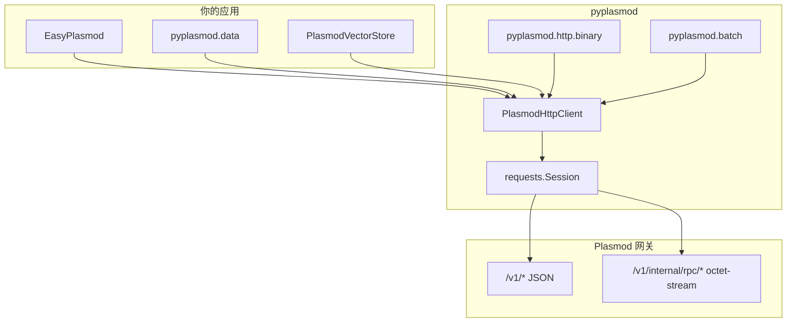

# pyplasmod SDK 说明

> **English** | [../SDK.md](../SDK.md)  
> **新手入门**（安装、网关启动、5 分钟跑通、环境变量、分场景示例）：请阅读 **[README.zh-CN.md](../../README.zh-CN.md)**。  
> 本文说明 **SDK 架构、各模块如何实现、以及完整 API 索引**。

---

## 1. 定位与边界

**pyplasmod** 是 [Plasmod](https://github.com/CodeSoul-co/Plasmod) 的 **Python HTTP 客户端**：通过 `requests` 调用已部署网关的 JSON API，并对部分 `/v1/internal/rpc/*` 端点提供二进制帧编解码。

| 包含 | 不包含 |
|------|--------|
| Tier A JSON（ingest、query、memory、admin 等） | Plasmod 服务端进程本身 |
| Tier B 扩展 JSON（internal task/MAS、CRUD 等） | gRPC、collection/schema ORM |
| PLIB / PLQW / PLQB 二进制 RPC 封装 | 自动生成的 OpenAPI 客户端 |
| `.fbin` → `ingest_event` 批量辅助 | 服务端路由/字段的权威定义（以 Plasmod `docs/api` 为准） |

服务端契约权威来源：[Plasmod HTTP API](https://github.com/CodeSoul-co/Plasmod/tree/main/docs/api)；二进制帧布局与 Go 端 `src/internal/transport/framing.go` 对齐。

---

## 2. 架构总览



**数据流（典型 RAG 路径）**

1. **入库**：`.fbin` 经 `upload()` 每行构造 `ingest_event` → `POST /v1/ingest/events`；或 `ingest_document` / `ingest_vectors` / `rpc_ingest_batch`。
2. **物化**：网关将事件物化为 Memory（客户端不实现此逻辑）。
3. **查询**：`build_query_body` 组装 JSON → `POST /v1/query` → 返回 `objects`、`hits` 等（字段随服务端版本变化）。
4. **运维**：`p.http.dataset_delete` / `dataset_purge` 等走 `/v1/admin/*`，需 `X-Admin-Key`（若网关启用）。

---

## 3. 模块布局与职责

| 模块 | 文件 | 职责 |
|------|------|------|
| 包入口 | `pyplasmod/__init__.py` | 导出 `EasyPlasmod`、`PlasmodEmbedding`、`PlasmodClient`、`plasmod_help`、编解码函数等；`PlasmodVectorStore` 懒加载 |
| 精简门面 | `pyplasmod/easy.py` | `EasyPlasmod`：包装常用 JSON 调用，`.embedding` / `embed_*` 网关嵌入，`.http` 暴露完整客户端 |
| 网关嵌入 | `pyplasmod/embedding/` | `PlasmodEmbedding`（推荐）、`EmbedderConfig` CPU/GPU 预设、`GatewayEmbedding`；见 [EMBEDDING.md](EMBEDDING.md) |
| HTTP 客户端 | `pyplasmod/http/client.py` | `PlasmodHttpClient`：`request_json` / `request_bytes`、Tier A/B 方法、`rpc_*`、批量 `ingest_batch` |
| Warm 索引辅助 | `pyplasmod/http/warm_index.py` | ANN `index_type` 常量、`normalize_warm_index_type`、`warm_index_ingest_fields`（`POST /v1/ingest/vectors`） |
| 二进制帧 | `pyplasmod/http/binary.py` | `encode_ingest_batch`（PLIB）、`encode_query_warm`（PLQW）、`encode_query_warm_batch`（PLQB）及解码 |
| HTTP 错误 | `pyplasmod/http/errors.py` | `PlasmodHttpError` |
| 通用异常 | `pyplasmod/exceptions.py` | `PlasmodException`、`ConnectError`、`ParamError` 等 |
| 数据辅助 | `pyplasmod/data/__init__.py` | `upload`、`build_query_body`；CLI：`python -m pyplasmod.data` |
| 批量工具 | `pyplasmod/batch.py` | `iter_batches`、`BatchResult`、`DEFAULT_BATCH_SIZE` |
| 包内帮助 | `pyplasmod/package_help.py` | `plasmod_help`、`plasmod_topics` |
| LangChain | `pyplasmod/langchain/vectorstore.py` | `PlasmodVectorStore`（可选依赖） |

设计说明见 [plans/pyplasmod-001-http-sdk-design.md](plans/pyplasmod-001-http-sdk-design.md)。

---

## 4. 客户端入口如何选择

| 符号 | 类型 | 何时使用 |
|------|------|----------|
| `EasyPlasmod` | 门面类 | 应用集成默认选型：`health`、`search`、`query`、`upload_fbin`、`ingest_document`、`memories` |
| `PlasmodEmbedding` | 嵌入门面 | 网关侧文本嵌入 + CPU/GPU 部署预设 + `runtime()` 探针；`with PlasmodEmbedding.connect()` |
| `PlasmodClient` / `PlasmodHttpClient` | 同一完整客户端 | Admin、RPC、CRUD、internal、WAL SSE、批量向量 |
| `upload` / `build_query_body` | 模块级函数 | 脚本或管道：可 `client=None` 临时建连，或 `client=p.http` 复用 |
| `PlasmodVectorStore` | LangChain 适配器 | 客户端本地 embed + `rpc_ingest_batch`；与网关嵌入路径不同 |

`EasyPlasmod` **不复制**完整 API，而是通过 **`self.http: PlasmodHttpClient`** 委托：

```python
class EasyPlasmod:
  def __init__(...):
    self.http = PlasmodHttpClient(base_url=..., timeout=..., admin_key=..., session=...)
  def search(self, query_text, workspace_id, **kwargs):
    return self.http.query(build_query_body(query_text, workspace_id, **kwargs))
```

支持上下文管理器：`with EasyPlasmod() as p:` → `close()` 关闭底层 `requests.Session`。

---

## 5. 配置与环境变量

`PlasmodHttpClient.__init__` 解析顺序（构造参数优先于环境变量）：

| 配置项 | 环境变量 | 默认值 |
|--------|----------|--------|
| 网关根 URL | `PLASMOD_BASE_URL` / `ANDB_BASE_URL` | `http://127.0.0.1:8080` |
| HTTP 超时（秒） | `PLASMOD_HTTP_TIMEOUT` / `ANDB_HTTP_TIMEOUT` | `30` |
| Admin Key | `PLASMOD_ADMIN_API_KEY` / `ANDB_ADMIN_API_KEY` | 空（不发送头） |

**Admin 路由**：凡 `path.startswith("/v1/admin/")` 且 `admin_key` 非空，自动设置请求头 `X-Admin-Key`。是否强制校验由网关 `PLASMOD_ADMIN_API_KEY` 部署决定。

可传入已有 `requests.Session` 以与业务侧连接池复用。

---

## 6. HTTP 传输层实现

### 6.1 `request_json`

1. 合并 Admin 头与 `Accept: application/json`。
2. `session.request(method, base_url + path, json=..., params=..., timeout=...)`。
3. 网络异常 → `PlasmodHttpError(status_code=0, reason=..., path=...)`。
4. 非 2xx → `PlasmodHttpError`（含 `status_code`、`body` 文本、`response_headers`）。
5. 2xx 且 body 为空 → `None`；`Content-Type` 含 `json` 或能 `resp.json()` → 解析为 `dict`/`list`。

### 6.2 `request_bytes`

用于二进制 RPC：`POST` + `data=payload` + `Content-Type: application/octet-stream`。返回 `(status_code, raw_bytes, headers)`，由 `rpc_*` 方法判断 `status == 200` 并解码。

### 6.3 WAL SSE：`iter_wal_stream_events`

- `GET /v1/wal/stream`，`stream=True`，超时 `(connect_timeout, None)` 避免长连接被读超时切断。
- 解析 `event: wal` + `data:` JSON 行；注释心跳 `:` 开头行跳过。
- 迭代结束或异常时在 `finally` 中 `resp.close()`。

---

## 7. `pyplasmod.data` 实现细节

### 7.1 `.fbin` 文件格式

| 偏移 | 内容 |
|------|------|
| 0–3 | `uint32` 行数 `n`（little-endian） |
| 4–7 | `uint32` 维度 `dim` |
| 8+ | `n × dim` 个 `float32`（little-endian），按行排列 |

`upload()` **仅**接受后缀 `.fbin`（大小写不敏感）；否则 `ValueError`。

### 7.2 `upload()` 流程

```
读 header → 逐行迭代
  → _build_fbin_event(...) 构造 ingest 事件 dict
  → client.ingest_event(body)   # POST /v1/ingest/events，每行一次
```

**事件字段要点**（与网关 `MaterializeEvent` 对齐）：

- 顶层 `embedding_vector`：完整 float 向量。
- `workspace_id`、`agent_id`（默认 `pyplasmod_data`）、`session_id`（默认 `ingest_{dataset}_{文件名}`）。
- `payload`：`text`（含 `dataset=`、`dataset_name:` 等标记）、`dataset`、`file_name`、`row_index`、`import_batch_id` 等。
- `event_id`：由 dataset、文件名、`import_batch_id`、`seq` 生成，保证可区分批次。

**参数行为**：

- `limit > 0`：最多入库前 `limit` 行。
- `import_batch_id` 为空：每次 `upload()` 调用生成新的 UTC 时间戳 batch id（同秒两次调用也不重复）。
- `dry_run=True`：只构建首行事件，不 POST。
- `show_progress=True`：stderr 单行进度条。

### 7.3 `build_query_body()` 与 session 对齐

**不发起 HTTP**，只返回 `POST /v1/query` 用的 `dict`。

默认 `session_id` 规则：

- 若传入非空 `session_id` → 使用该值。
- 否则若同时有 `dataset_name` 与 `ingest_fbin_path` → `ingest_{dataset}_{Path(ingest_fbin_path).name}`（与 `upload` 默认一致）。
- 否则 → `query_{workspace_id}`。

`query_scope` 与 `workspace_id` 均设为传入的 `workspace_id`。`extra={...}` 在末尾 merge，可覆盖任意字段。

可选 `embedding_vector`：传入预计算向量时，网关 **不再** 调用 embedder（维度须与 `PLASMOD_EMBEDDER_DIM` 一致）。

**重要**：网关按结构化过滤（如 `dataset_name`）时，查询侧的 `session_id` / `agent_id` 须与入库一致，否则可能查不到刚导入的数据。

---

## 8. 网关嵌入（`pyplasmod.embedding`）

用户指南：[EMBEDDING.md](EMBEDDING.md)。Plasmod **无** `POST /v1/embed`；嵌入在 ingest/query 路径内完成。

### 8.1 推荐：`PlasmodEmbedding`

```python
from pyplasmod import PlasmodEmbedding

with PlasmodEmbedding.connect() as emb:
    emb.ingest("文本", workspace_id="w_demo")
    emb.search("检索", workspace_id="w_demo", top_k=5)
    emb.runtime()  # EmbeddingRuntimeInfo: family, dim
```

`EasyPlasmod.embedding` 为同一门面（懒加载）；`embed_ingest` / `embed_search` 为简写。

### 8.2 CPU / GPU 部署预设

| 方法 | 设备 |
|------|------|
| `use_cpu("onnx", model_path=..., apply=True)` | CPU |
| `use_gpu("onnx", model_path=..., apply=True)` | CUDA |
| `use_onnx_cpu` / `use_onnx_gpu` | 显式 ONNX |
| `use_gguf_cpu` / `use_gguf_gpu` | GGUF + llama.cpp |
| `use_gpu("tensorrt", ...)` | TensorRT（仅 CUDA） |

`apply=True` → `EmbedderConfig.apply_to_environ()`，须在 **启动 Plasmod 进程前** 执行。

`capabilities()` / `format_capability_table()` 打印 provider × {cpu, cuda, metal} 矩阵。

### 8.3 运行时探针

`POST /v1/query` 响应 `provenance` 可含：

- `embedding_runtime_family=...`
- `embedding_runtime_dim=N`

`PlasmodHttpClient.fetch_embedding_runtime()`、`PlasmodEmbedding.runtime()` 解析上述字段。**不包含** `device`（device 仅来自服务端 `PLASMOD_EMBEDDER_DEVICE`）。

### 8.4 模块分层

| 层 | 类型 | 说明 |
|----|------|------|
| 用户 | `PlasmodEmbedding` | `ingest` / `search` / `use_*` / `runtime` |
| 配置 | `EmbedderConfig` | 环境变量 ↔ 预设 |
| HTTP | `GatewayEmbedding` | 直接包装 `PlasmodHttpClient` |

---

## 9. 二进制 RPC（PLIB / PLQW / PLQB）

实现于 `pyplasmod/http/binary.py`，与 Go `framing.go` 一致。

| Magic | 用途 | 客户端方法 |
|-------|------|------------|
| `PLIB` | 批量向量入库 | `rpc_ingest_batch` → `POST /v1/internal/rpc/ingest_batch` |
| `PLQW` | 单向量 warm 查询 | `rpc_query_warm` |
| `PLQB` | 多向量 warm 批量查询 | `rpc_query_warm_batch`、`rpc_query_warm_batch_raw` |

`PlasmodHttpClient.ingest_batch()` 在 RPC 之上按 `DEFAULT_BATCH_SIZE`（500）自动分片，汇总为 `BatchResult`（`accepted_count`、`errors` 等）。

也可直接使用根包导出的 `encode_*` / `decode_*` 自行组 `request_bytes`。

---

## 10. 批量与 JSON 向量入库

| 方法 | 路径 | 说明 |
|------|------|------|
| `ingest_vectors(vectors, segment_id=..., object_ids=..., index_type=..., ivf_*=...)` | `POST /v1/ingest/vectors` | JSON 矩阵；**warm ANN 索引类型**（HNSW、IVF_*、DISKANN）— 见下文 |
| `ingest_batch(segment_id, vectors, ...)` | RPC PLIB | 大批量，自动分批；**无 `index_type`**（网关默认） |
| `ingest_events(events)` | 多次 `ingest_event` | 逐条事件 |
| `add_vectors(...)` | 封装 `ingest_batch` + 可选 `ingest_event` | PLIB 路径，与 `ingest_batch` 相同索引限制 |

向量维度须与网关 warm 段 / 嵌入配置一致。

### Warm 段 ANN 索引（仅 `ingest_vectors`）

`PlasmodHttpClient.ingest_vectors` 用调用方提供的向量构建 warm 段；**入库时**通过 JSON 选择 ANN 索引，字段与 Plasmod `warm_segment_ingest`（`schemas/warm_segment_ingest.go`）对齐。

| `index_type` | 典型场景 |
|--------------|----------|
| `HNSW`（省略时默认） | 通用、低延迟检索 |
| `IVF_FLAT` / `IVF_PQ` / `IVF_SQ8` | 大规模；可调 `ivf_nlist`、`ivf_nprobe` 等 |
| `DISKANN` | 磁盘友好、超大规模 |

可选 IVF 字段（非零/非空才发送）：`ivf_nlist`、`ivf_nprobe`、`ivf_m`、`ivf_nbits`、`ivf_sq_type`（`IVF_SQ8` 用 `INT8` / `FP32`）。可用根包常量（`WARM_INDEX_IVF_FLAT` 等）或 `normalize_warm_index_type("ivf_flat")`。

```python
from pyplasmod import PlasmodClient, WARM_INDEX_IVF_FLAT

with PlasmodClient() as c:
    c.ingest_vectors(
        [[0.1, 0.2, ...]],
        segment_id="demo.ivf",
        index_type=WARM_INDEX_IVF_FLAT,
        ivf_nlist=128,
        ivf_nprobe=32,
    )
```

**路径区分：** `ingest_batch` / `rpc_ingest_batch`（PLIB）当前 SDK **不暴露** `index_type`。非默认 ANN 索引请用 `ingest_vectors`（可按段多次调用），待 PLIB 支持索引元数据后再扩展。

查询时使用构建该索引的同一 `segment_id` / `warm_segment_id`。

`validate_batch_size` 将 `batch_size` 限制在 `[1, MAX_BATCH_VECTORS]`（`MAX_BATCH_VECTORS = 2^22`）。

---

## 11. 错误模型

| 类型 | 何时抛出 |
|------|----------|
| `PlasmodHttpError` | HTTP 非 2xx、RPC 非 200、或 `requests` 在收到响应前失败（`status_code=0`） |
| `PlasmodException` | 批量入库中某批失败且 `raise_on_error=True` |
| `ValueError` | 参数非法、`.fbin` 后缀不支持、`upload` 文件损坏等 |
| `FileNotFoundError` | `upload` 路径不存在 |

捕获 HTTP 错误示例：

```python
from pyplasmod import EasyPlasmod, PlasmodHttpError

try:
    with EasyPlasmod() as p:
        p.query({"invalid": True})
except PlasmodHttpError as e:
    print(e.status_code, e.path, e.body[:200])
```

更多用法见 [plans/pyplasmod-003-sdk-usage-guide.md](plans/pyplasmod-003-sdk-usage-guide.md)。

---

## 12. LangChain 集成（实现概要）

`PlasmodVectorStore`（`pyplasmod/langchain/vectorstore.py`）：

- 构造时持有 `PlasmodHttpClient` + LangChain `Embeddings`。
- `add_texts` / `add_documents`：本地 embed → `rpc_ingest_batch`（分批）+ 尽力 `ingest_event` 写元数据；**不能**选择 warm ANN `index_type`，需 IVF/DISKANN 时请用 `ingest_vectors`。
- `similarity_search*`：`build_query_body` + `query`，或 warm 路径 `rpc_query_warm`。
- `delete`、`max_marginal_relevance_search` 暂未实现（`NotImplementedError`）。

安装：`pip install pyplasmod[langchain]`。示例：`examples/langchain_quickstart.py`。

---

## 13. 包内帮助系统

`plasmod_help(topic=None)`（`pyplasmod/package_help.py`）：

| 主题 key | 内容 |
|----------|------|
| `easy` | `EasyPlasmod` 说明 + `pydoc` 全文 |
| `client` | `PlasmodHttpClient` 索引（建议 `help(PlasmodHttpClient)`） |
| `upload` | `pyplasmod.data.upload` |
| `querybody` | `build_query_body` |
| `errors` | `PlasmodHttpError` |
| `binary` | `pyplasmod.http.binary` 模块 |
| `env` | 环境变量说明 |
| `embedding` | `PlasmodEmbedding` / CPU·GPU 预设 |

别名：`plasmodclient`→`client`，`fbin`/`ingest`→`upload` 等。CLI：`python -m pyplasmod [topic]`（`pyplasmod/__main__.py`）。

---

## 14. API 索引（按模块）

下面按模块整理 **函数/方法名 + 用途**。私有方法（`_url`、`_finish_json` 等）不列。路径与请求体字段以 Plasmod 网关为准。

### 14.1 根包 `from pyplasmod import …`

| 符号 | 用途 |
|------|------|
| **`EasyPlasmod`** | 精简入口类（见 §14.2） |
| **`PlasmodEmbedding`** | 网关嵌入门面（见 §8、`embedding/facade.py`） |
| **`open_embedding`** | `PlasmodEmbedding.connect` 别名 |
| **`EmbedderConfig`**、`**EmbeddingRuntimeInfo**` | CPU/GPU 配置与运行时探针 |
| **`PlasmodClient`** | `PlasmodHttpClient` 别名 |
| **`PlasmodHttpError`** | 非 2xx HTTP 时抛出 |
| **`PlasmodException`**、`ConnectError`、`ParamError`、`PlasmodUnavailableException` | SDK 分类异常 |
| **`BatchResult`** | 批量操作汇总 |
| **`DEFAULT_BATCH_SIZE`**、`**MAX_BATCH_VECTORS**` | 默认批量大小与上限 |
| **`iter_batches`**、`**validate_batch_size**` | 分批迭代与校验 |
| **`encode_ingest_batch`** 等 | 二进制帧编解码（不发起 HTTP） |
| **`WARM_INDEX_HNSW`**、`**WARM_INDEX_IVF_*`**、`**WARM_INDEX_DISKANN`**、`**WARM_INDEX_TYPES**` | 支持的 warm ANN 索引类型字符串 |
| **`normalize_warm_index_type`**、`**warm_index_ingest_fields**` | 校验 / 构造 `ingest_vectors` 的 JSON 字段 |
| **`plasmod_help`**、`**plasmod_topics**` | 主题帮助 |
| **`__version__`** | 包版本 |
| **`PlasmodVectorStore`** | LangChain 适配器（懒加载） |

### 14.2 `EasyPlasmod` 实例方法

| 方法 | HTTP | 用途 |
|------|------|------|
| **`__init__(base_url=..., timeout=..., admin_key=..., session=...)`** | — | 构造；读环境变量 |
| **`close()`** | — | 关闭 Session |
| **`health()`** | `GET /healthz` | 存活探针 |
| **`system_mode()`** | `GET /v1/system/mode` | 系统模式 |
| **`query(body)`** | `POST /v1/query` | 完整查询 JSON |
| **`search(query_text, workspace_id, **kwargs)`** | `POST /v1/query` | `build_query_body` + `query` |
| **`ingest_event(event)`** | `POST /v1/ingest/events` | 单条事件 |
| **`ingest_document(body)`** | `POST /v1/ingest/document` | 长文档分块 |
| **`upload_fbin(...)`** | `POST /v1/ingest/events`（逐行） | 封装 `data.upload` |
| **`memories(workspace_id, **params)`** | `GET /v1/memory` | 列举 Memory |
| **`embedding`** | — | **`PlasmodEmbedding`**（懒加载） |
| **`embed_ingest` / `embed_search`** | ingest / query | `embedding.ingest` / `search` 简写 |
| **`embedding_runtime(**kw)`** | query 探针 | `embedding.runtime` |
| **`http`** | — | 完整 **`PlasmodHttpClient`** |

### 14.3 `pyplasmod.embedding`

| 符号 | 用途 |
|------|------|
| **`PlasmodEmbedding`** | 推荐门面：`connect`、`ingest`、`search`、`use_cpu`/`use_gpu`、`runtime` |
| **`open_embedding()`** | 工厂 |
| **`EmbedderConfig`** | `onnx_cpu`/`onnx_cuda`/… 预设、`to_environ` / `from_environ` |
| **`GatewayEmbedding`** | 低级 HTTP 包装 |
| **`format_capability_table()`** | CPU/GPU 能力表 |

### 14.4 `pyplasmod.data`

| 函数 | 用途 |
|------|------|
| **`build_query_body(query_text, workspace_id, *, ...)`** | 仅构造查询 `dict` |
| **`upload(dataset, workspace_id, path, *, client=..., ...)`** | `.fbin` → 多次 `ingest_event` |

CLI：`python -m pyplasmod.data upload|query ...`

### 14.5 `PlasmodHttpClient` — 通用 HTTP

| 方法 | HTTP | 用途 |
|------|------|------|
| **`request_json(...)`** | 任意 | JSON 请求 |
| **`request_bytes(...)`** | 任意 | 原始 body |
| **`health()`** | `GET /healthz` | |
| **`system_mode()`** | `GET /v1/system/mode` | |
| **`ingest_event(event)`** | `POST /v1/ingest/events` | |
| **`ingest_vectors(...)`** | `POST /v1/ingest/vectors` | JSON 向量；可选 `index_type`、IVF 调参（`ivf_nlist` 等） |
| **`ingest_document(body)`** | `POST /v1/ingest/document` | |
| **`query(body)`** | `POST /v1/query` | |
| **`query_batch(body)`** | `POST /v1/query/batch` | warm 批量 ANN |
| **`memory_get(params)`** | `GET /v1/memory` | |
| **`memory_post(body)`** | `POST /v1/memory` | |
| **`ingest_batch(...)`** | RPC | 自动分批 PLIB |
| **`add_vectors(...)`** | RPC + 可选 event | 高层批量添加 |
| **`ingest_events(...)`** | 多次 events | 事件列表 |
| **`batch_query(...)`** | `query_batch` | 大批量查询封装 |
| **`iter_wal_stream_events(...)`** | `GET /v1/wal/stream` | SSE WAL |
| **`rpc_ingest_batch`** | `POST .../ingest_batch` | PLIB |
| **`rpc_query_warm`** | `POST .../query_warm` | PLQW |
| **`rpc_query_warm_batch`** / **`rpc_query_warm_batch_raw`** | `POST .../query_warm_batch*` | PLQB |

### 14.6 Admin / 数据集 / 记忆运维

| 方法 | 用途 |
|------|------|
| **`admin_memory_delete_by_source(body)`** | 按来源软删 memory |
| **`admin_memory_purge_by_source(body)`** | 按来源硬删 / 异步 purge |
| **`warm_prebuild()`** | 预热构建 |
| **`dataset_delete(body)`** | 数据集软删 |
| **`dataset_purge(body)`** | 数据集 purge |
| **`dataset_purge_task(task_id)`** | purge 任务状态 |
| **`admin_dataset_purge`** / **`admin_dataset_purge_task`** | 别名 |
| **`warm_segment_register(body)`** | 注册 warm 段 |
| **`admin_topology_get`**、`**admin_storage_get**`、`**admin_config_effective_get**` | 拓扑 / 存储 / 配置 |
| **`admin_s3_export`** 等 | S3 运维 |
| **`admin_data_wipe`**、`**admin_rollback**`、`**admin_replay**` | 高危运维 |
| **`admin_consistency_mode_*`**、`**admin_metrics_get**` | 一致性 / 指标 |
| **`admin_governance_mode_*`**、`**admin_runtime_mode_*`** | 治理 / 运行时 |
| **`admin_algorithm_profile_*`** | 算法 profile |

### 14.7 资源 CRUD（JSON）

| 方法 | 用途 |
|------|------|
| **`agents_get/post`**、`**sessions_get/post**` | Agent / Session |
| **`states_get/post`**、`**artifacts_get/post**` | State / Artifact |
| **`edges_get/post`**、`**policies_get/post**` | Edge / Policy |
| **`share_contracts_get/post`** | 共享合约 |
| **`traces_get(object_id)`** | 追踪 / 证明链 |
| **`agent_list_get`** | Agent 列表 |

### 14.8 internal memory / task / MAS

| 方法 | 用途 |
|------|------|
| **`internal_memory_recall/ingest/compress/summarize/decay/share`** | 内部记忆生命周期 |
| **`internal_memory_conflict_*`** | 冲突处理 |
| **`internal_task_*`** | 内部任务 |
| **`internal_plan_step/repair`** | 计划 |
| **`internal_mas_*`** | MAS 聚合 |
| **`internal_tool_state_get`**、`**internal_agent_handoff**` | 工具状态 / handoff |
| **`internal_session_context_get`** | 会话上下文 |
| **`internal_eval_ground_truth_*`** | 评测 |
| **`debug_echo(body)`** | 测试模式调试 |

### 14.9 `pyplasmod.langchain`

| 类 / 方法 | 用途 |
|-----------|------|
| **`PlasmodVectorStore`** | LangChain `VectorStore` 实现 |
| **`delete`**、**`max_marginal_relevance_search`** | 未实现 |

### 14.10 命令行

| 入口 | 用途 |
|------|------|
| **`python -m pyplasmod [topic]`** | 包帮助 |
| **`python -m pyplasmod.data ...`** | upload / query 子命令 |

---

## 15. 相关文档

| 文档 | 说明 |
|------|------|
| [README.md](../README.md) | 安装、快速开始、场景示例 |
| [EMBEDDING.md](EMBEDDING.md) | 网关嵌入与 CPU/GPU（`PlasmodEmbedding`） |
| [plans/pyplasmod-001-http-sdk-design.md](plans/pyplasmod-001-http-sdk-design.md) | HTTP SDK 架构说明 |
| [plans/pyplasmod-002-gateway-tier-b-shortcuts-design.md](plans/pyplasmod-002-gateway-tier-b-shortcuts-design.md) | Tier B 扩展 API |
| [plans/pyplasmod-003-sdk-usage-guide.md](plans/pyplasmod-003-sdk-usage-guide.md) | 用户指南（参数、样例、排错） |
| [Plasmod docs/api](https://github.com/CodeSoul-co/Plasmod/tree/main/docs/api) | 服务端 API 权威说明 |
