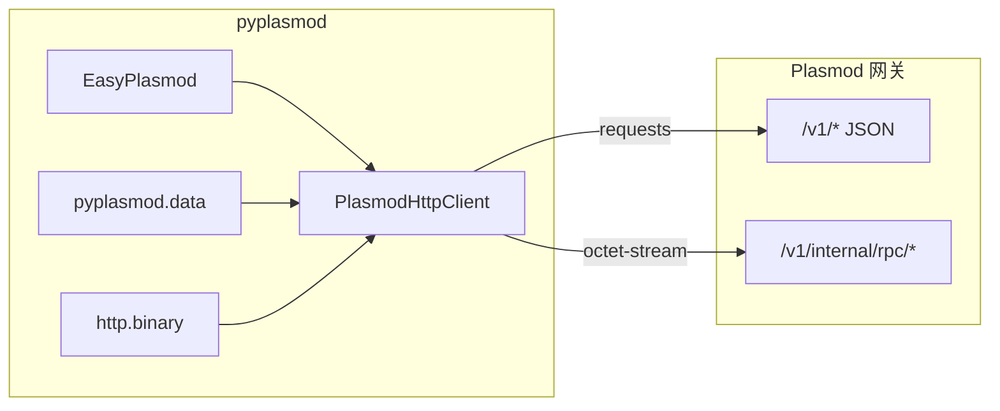

# pyplasmod HTTP SDK 架构说明

| 元数据 | 值 |
|--------|-----|
| **文档编号** | pyplasmod-001 |
| **状态** | 已实现（随版本演进） |
| **创建** | 2026-05-06 |
| **更新** | 2026-05-18 |
| **维护方** | [CodeSoul-co](https://github.com/CodeSoul-co) |
| **读者** | 集成 pyplasmod 的应用开发者、贡献者 |

> **快速上手**请参阅仓库 [README.md](../../README.md)（安装、网关启动、示例）。  
> **API 索引与实现细节**请参阅 [docs/SDK.md](../SDK.md)。  
> **参数填法与场景样例**请参阅 [pyplasmod-003-sdk-usage-guide.md](pyplasmod-003-sdk-usage-guide.md)。

---

## 1. 概述

**pyplasmod** 是 [Plasmod](https://github.com/CodeSoul-co/Plasmod) 的 **Python HTTP 客户端库**。它通过标准 HTTP 访问已部署的 Plasmod 网关，并对部分 `/v1/internal/rpc/*` 端点提供二进制帧（PLIB / PLQW / PLQB）编解码支持。

本说明描述客户端的**架构边界、模块划分、配置契约与错误模型**。路由、请求/响应 JSON 字段的权威定义以 Plasmod 官方文档为准：

- [Plasmod HTTP API](https://github.com/CodeSoul-co/Plasmod/tree/main/docs/api)
- 服务端路由注册：[`Gateway.RegisterRoutes`](https://github.com/CodeSoul-co/Plasmod/blob/main/src/internal/access/gateway.go)
- 二进制帧布局：服务端 `src/internal/transport/framing.go`

---

## 2. 目标与非目标

### 2.1 目标

| 目标 | 说明 |
|------|------|
| **统一 HTTP 客户端** | 提供 `PlasmodHttpClient`（别名 `PlasmodClient`），覆盖 Tier A JSON、二进制 RPC 及 Tier B 扩展 JSON |
| **精简应用入口** | 提供 `EasyPlasmod` 门面，封装健康检查、检索、文档入库、`.fbin` 上传等高频路径 |
| **数据辅助层** | `pyplasmod.data` 提供 `build_query_body`、`upload`，与 HTTP 解耦、可复用连接 |
| **二进制互操作** | `pyplasmod.http.binary` 与 Go 端 framing 对齐，供 `rpc_*` 及高级集成使用 |
| **最小运行时依赖** | 核心仅依赖 `requests`；LangChain 适配为可选 extra |

### 2.2 非目标

- 不包含 Plasmod **服务端**二进制或部署逻辑（见 README「启动 Plasmod 网关」）。
- 不提供 gRPC、collection/schema ORM 或 collection/schema 管理 API。
- 不内嵌完整 OpenAPI 副本；字段变更以 Plasmod `docs/api` 为准。
- 不保证与 Plasmod 未发布或实验性路由的向前兼容（以网关实际注册为准）。

---

## 3. 与 Plasmod 网关的关系

| 层级 | 客户端职责 | 网关职责 |
|------|------------|----------|
| 入库 | 构造 `ingest_event` / `ingest_document` / 向量或 PLIB 帧并 POST | 校验、写入 WAL、物化为 Memory 等 |
| 查询 | 构造 `POST /v1/query` JSON | 检索、融合、组装 structured evidence |
| 运维 | 调用 `/v1/admin/*`（带 `X-Admin-Key`） | 数据集删除/purge、拓扑、配置等 |

客户端**不实现**物化、索引构建或检索算法，仅负责传输与帧格式。

---

## 4. 模块结构

| 模块 | 路径 | 职责 |
|------|------|------|
| 包入口 | `pyplasmod/__init__.py` | 导出公共 API、`__version__`、`PlasmodVectorStore` 懒加载 |
| 应用门面 | `pyplasmod/easy.py` | `EasyPlasmod`：高频 JSON 封装；`http` 属性暴露完整客户端 |
| HTTP 客户端 | `pyplasmod/http/client.py` | `PlasmodHttpClient`：`request_json` / `request_bytes`、Tier A/B 方法、`rpc_*`、批量辅助 |
| 二进制帧 | `pyplasmod/http/binary.py` | PLIB / PLQW / PLQB 编解码 |
| HTTP 错误 | `pyplasmod/http/errors.py` | `PlasmodHttpError` |
| 通用异常 | `pyplasmod/exceptions.py` | `PlasmodException` 及分类异常 |
| 数据辅助 | `pyplasmod/data/__init__.py` | `upload`、`build_query_body`；CLI `python -m pyplasmod.data` |
| 批量工具 | `pyplasmod/batch.py` | `iter_batches`、`BatchResult`、`ingest_batch` 分片 |
| 包内帮助 | `pyplasmod/package_help.py` | `plasmod_help`、`plasmod_topics` |
| LangChain（可选） | `pyplasmod/langchain/` | `PlasmodVectorStore` |

---

## 5. API 分层（Tier A / Tier B / RPC）

### 5.1 Tier A（核心 JSON）

面向大多数集成场景，包括但不限于：

| 类别 | 代表路径 | 客户端入口 |
|------|----------|------------|
| 健康 | `GET /healthz`、`GET /v1/system/mode` | `health()`、`system_mode()` |
| 入库 | `POST /v1/ingest/events`、`/ingest/document`、`/ingest/vectors` | `ingest_event`、`ingest_document`、`ingest_vectors`；`data.upload` |
| 查询 | `POST /v1/query`、`/query/batch` | `query`、`query_batch`；`EasyPlasmod.search` |
| Memory | `GET/POST /v1/memory` | `memory_get`、`memory_post`；`EasyPlasmod.memories` |
| Admin（子集） | `dataset/delete`、`dataset/purge`、`warm/prebuild` 等 | `dataset_*`、`warm_prebuild` |
| 内部（子集） | warm-segment 注册、memory 算法桥 | `warm_segment_register`、`internal_memory_*` |

### 5.2 二进制 RPC

| Magic | 路径 | 方法 |
|-------|------|------|
| PLIB | `POST /v1/internal/rpc/ingest_batch` | `rpc_ingest_batch`；高层 `ingest_batch` |
| PLQW | `POST .../query_warm` | `rpc_query_warm` |
| PLQB | `POST .../query_warm_batch`（及 `_raw`） | `rpc_query_warm_batch`、`rpc_query_warm_batch_raw` |

### 5.3 Tier B（扩展 JSON）

在 Tier A 之外，`PlasmodHttpClient` 为 `Gateway.RegisterRoutes` 中其余 JSON 路由提供具名薄封装（Admin 扩展、internal task/MAS、agent list、session context、eval 等）。设计细节见 [pyplasmod-002-gateway-tier-b-shortcuts-design.md](pyplasmod-002-gateway-tier-b-shortcuts-design.md)。

---

## 6. 配置契约

构造 `PlasmodHttpClient` / `EasyPlasmod` 时，**构造参数优先于环境变量**。

| 配置项 | 环境变量 | 默认值 |
|--------|----------|--------|
| 网关根 URL | `PLASMOD_BASE_URL` / `ANDB_BASE_URL` | `http://127.0.0.1:8080` |
| HTTP 超时（秒） | `PLASMOD_HTTP_TIMEOUT` / `ANDB_HTTP_TIMEOUT` | `30` |
| Admin API Key | `PLASMOD_ADMIN_API_KEY` / `ANDB_ADMIN_API_KEY` | 空（不向 Admin 路由附加头） |

**Admin 鉴权**：当 `path` 以 `/v1/admin/` 开头且 `admin_key` 非空时，自动设置请求头 `X-Admin-Key`。是否强制校验由网关部署配置决定（见 Plasmod 运维说明）。

可选传入 `requests.Session` 以复用 TCP 连接；`with client:` 或 `EasyPlasmod.close()` 关闭自建 Session。

---

## 7. 错误模型

| 类型 | 触发条件 |
|------|----------|
| `PlasmodHttpError` | HTTP 非 2xx；RPC 非 200；`requests` 在收到响应前失败（`status_code=0`） |
| `PlasmodException` | 批量入库失败且 `raise_on_error=True` 等 SDK 逻辑错误 |
| `ValueError` | 参数非法、非 `.fbin` 后缀、`upload` 文件损坏等 |

`PlasmodHttpError` 提供 `status_code`、`path`、`body`、`reason`，便于日志与排错。用法见 [pyplasmod-003-sdk-usage-guide.md §8](pyplasmod-003-sdk-usage-guide.md#8-错误处理与排错)。

---

## 8. 应用层辅助（与 README 对齐）

| 场景 | 推荐 API | HTTP |
|------|----------|------|
| 长文本 / 文档 | `EasyPlasmod.ingest_document` | `POST /v1/ingest/document` |
| 单条结构化事件 | `ingest_event` | `POST /v1/ingest/events` |
| Bulk 向量文件 | `pyplasmod.data.upload` / `upload_fbin` | 每行一次 `ingest/events` |
| JSON 向量矩阵 | `ingest_vectors`（可选 `index_type`、IVF 字段）/ `ingest_batch` | `ingest/vectors` 或 RPC PLIB；ANN 索引仅 JSON 路径 |
| 自然语言检索 | `search` 或 `build_query_body` + `query` | `POST /v1/query` |

**会话对齐**：`upload` 默认 `session_id = ingest_{dataset}_{文件名}`；`build_query_body` 在提供 `dataset_name` 与 `ingest_fbin_path` 时可自动对齐。文档入库场景须在查询时显式传入相同的 `session_id` 与 `agent_id`。

---

## 9. 设计决策与备选方案

| 决策 | 理由 |
|------|------|
| 手写薄封装而非 OpenAPI 生成 | 契约仍在演进；手写方法 IDE 友好、变更面可控 |
| HTTP-only，不保留 gRPC | 与 Plasmod 统一部署故事一致 |
| `EasyPlasmod` + `PlasmodHttpClient` 双入口 | 降低入门成本，同时不限制高级集成 |
| Tier B 独立设计文档 | 扩展面大，命名规则需单独说明 |

**未采纳**：单一泛型 `admin_request(subpath)`（可发现性差）；同步维护完整 OpenAPI 客户端（维护成本高）。

---

## 10. 实现状态（摘要）

| 能力 | 状态 |
|------|------|
| Tier A ingest/query/admin/memory | 已实现 |
| `ingest_vectors` 的 warm ANN `index_type`（`pyplasmod.http.warm_index`） | 已实现 |
| 二进制 RPC + `ingest_batch` 分片 | 已实现 |
| `EasyPlasmod`、`pyplasmod.data` | 已实现 |
| Tier B JSON 快捷方法 | 已实现（见 002） |
| WAL SSE `iter_wal_stream_events` | 已实现 |
| 自动将 HTTP 状态映射为 `ConnectError` | 未实现（开放项） |
| 可选 `httpx` 异步客户端 | 未实现（开放项） |

---

## 11. 相关文档

| 文档 | 说明 |
|------|------|
| [README.md](../../README.md) | 安装、快速开始、分场景示例 |
| [docs/SDK.md](../SDK.md) | 模块实现、API 全量索引 |
| [pyplasmod-002-gateway-tier-b-shortcuts-design.md](pyplasmod-002-gateway-tier-b-shortcuts-design.md) | Tier B 命名与路由对照 |
| [pyplasmod-003-sdk-usage-guide.md](pyplasmod-003-sdk-usage-guide.md) | 参数说明、样例与排错 |
| [Plasmod docs/api](https://github.com/CodeSoul-co/Plasmod/tree/main/docs/api) | 服务端契约 |

---

## 12. 修订记录

| 日期 | 说明 |
|------|------|
| 2026-05-06 | 首版：Tier A + 二进制 RPC 架构 |
| 2026-05-18 | 对外规范化：补充与 README/SDK 对齐的应用层说明、Tier 分层表、实现状态 |
